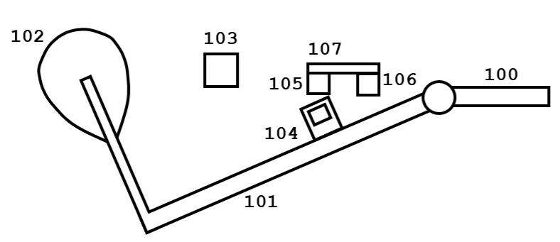
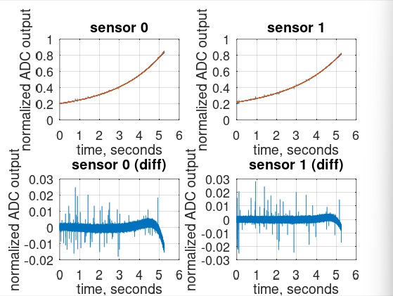

# 0. Piano Dynamics Processing System (PDPS)

The open source hybrid piano [1][2] (*OSH Piano*, also known as *stem piano*) measures piano hammer and key positions, converts measurements to velocity, and outputs the results over MIDI. The piano system streams raw sampled hammer and key positions over Ethernet. The key positions are also used to infer damper position.

The following describes a measurement and processing system including compensating for error sources.

The following system is not open source nor included as part of an open source piano.

Note that not all .md viewers show equation numbers. The text includes an equation number in description.

# 1. PDPS Block Diagrams

## Fig. 1 Mechanical System on Hammer

Side view of mechanical system and sensors at hammer.

| Item | Name | Description |
| - | - | - |
| 100 | Flange | Standard component of a grand piano action. |
| 101 | Shank | Standard component of a grand piano action. |
| 102 | Hammer | Standard component of a grand piano action. |
| 103 | Stop Bar | Physically stops the hammer motion. In a piano, the hammer would stop when it hits a piano string. |
| 104 | Optical gate | Precision cut gap in a thin material. Gap shape not necessarily as shown in figure. An alternate method is blocking in center and gap above and below in a 'flag' type structure. |
| 105 | Phototransmissive System (PTS) | Transmissive light emitting and receiving devices that straddle the optical gate 104 as the hammer 101 moves from rest position to position at stop bar 103. For absolute position measurement references. |
| 106 | Photoreflective System (PRS) | Reflective light emitting and receiving device for continuous hammer shank relative position measurements. |
| 107 | Sensing Mount | Connecting system for PTS 105 and PRS 106. |

## Fig. 2 Mechanical System on Key

Side view of mechanical system and sensors at back of piano key.

| Item | Name | Description |
| - | - | - |
| 201 | Piano key | Standard component of a grand piano action. Shown in figure is back side of the key at damper mechanism mount. Toward left in figure is rear of piano. Movement of key is up and donw. |
| 204 | Optical gate | Precision cut gap in a thin material. Gap shape not necessarily as shown in figure. |
| 205 | Phototransmissive System (PTS) | Same as 105. |
| 206 | Photoreflective System (PRS) | Same as 106. |
| 207 | Sensing Mount | Same as 107 with differences as needed to account for different physical geometry of a piano key compared to a hammer shank. |

## Fig. 3 Sensor System (104, 105, 106, 107)

Top view of sensor system at hammer shank. Sensor system for piano key (204), (205), (206), and (207) is functionally identical with different geometries. Components can locate at other positions along hammer shank. Fig. 3 shows one possible arrangement. The location depends on physical access, the transmitting and sensing range of PRS and PTS, and size of the optical gate (104) among other considerations. 

| Item | Name | Description |
| - | - | - |
| 300 | Shank | Standard component of a grand piano action. |
| 301 | PRS device | Reflective light emitting and receiving device. An example is a Vishay CNY70 [3]. |
| 302 | Photoreceiver | Circle represents the photoreceiver on bottom side of the PTS device pointing toward the hammer shank. |
| 303 | Photo emitter | Circle represents the photo emitter on bottom side of the PTS device pointing toward the hammer shank. |
| 304 | Optical gate | Top view of Fig. 1 optical gate 104. |
| 305 | Photoreceiver | Top view of the receiving device as part of Fig. 1 PTS 105.
| 306 | Photo emitter | Top view of the transmitting device as part of Fig. 1 PTS 105.

## Fig. 4 PTS and PRS Output Waveforms

The vertical axis is the analog output of a PTS or PRS photoreceiver. The horizontal axis is the hammer or key displacement from resting position. To the left on horizontal axis is hammer or key at rest. To the right on horizontal axis is hammer at 103 hammer stop bar position or damper at full piano key depressed position. Fig. 4 also functionally applies for key measurements.

| Item | Name | Description |
| - | - | - |
| 400 | PRS photoreceiver output signal | Response is nonlinear and subject to PRS (106) manufacturing tolerances.
| 401 | PTS photoreceiver output signal | Response is high when the optical gate (104) (304) is not blocking PTS photo emitter (306) and photo receiver (305) light path.
| 402 | Rest position | Output signal of PTS (105) is at level 406 and output of PRS (106) is at level 407.
| 403 | Optical gate start opening | Output signal of PTS (105) photoreceiver goes from level 406 to level 411 as optical gate opening starts to cross the PTS photo emitter (306) and photo receiver (305) light path. Output signal (400) of PRS (106) is at level 408.
| 404 | Optical gate end opening  | Output signal of PTS (105) goes from level 411 to level 406 as optical gate opening ends crossing of the PTS photo emitter (306) and photo receiver (305) light path. Output signal (400) of PRS (106) is at level 409.
| 405 | Max position | Output signal (401) of PTS (105) is at level 406 and output signal (400) of PRS (106) is at level 410 when hammer is at hammer stop (103). |

In an alternate embodiment, the optical gate is blocked at center and open at top and bottom. In this case, PTS photoreceiver output signal (401) is inverted.

## Fig. 5 Piano Dynamics Process System High Level Block Diagram

Each PRS, PTS, and ADC section in Fig. 5 replicates for each hammer. Similarly for each key. A total of 88 are required for all 88 piano hammers and another 88 optionally for all 88 piano keys. If piano dampers are not used then damper position is estimated from hammer position and not from key.

| Item | Name | Description |
| - | - | - |
| 500 | Processing system  | The microprocessor, memory, I/O, LCD, power, and algorithms. |
| 501 | PRS | One of PRS 106 for a hammer. |
| 502 | PRS output signal | Waveform along this wire connection is similar to PRS photoreceiver output signal (400). |
| 503 | PTS | One of PTS 105 for a hammer. | 
| 504 | PTS output signal | Waveform along this wire connection is similar to PTS photoreceiver output signal (401). |
| 505 | Analog to digital converter system (ADC) | Each analog waveform signal connects to a device that converts the signal to a number. In a typical system the sample rate at least meets they Nyquist rate. Each ADC system may include gain circuits, isolation circuits, anti-alias filtering, and other analog signal conditioning. Multiple inputs may be multiplexed into single or sets of ADC.
| 506 | MIDI | System outputs a MIDI signal calculated according to algorithms as described later. |
| 507 | Ethernet | System outputs streaming ADC samples for hammer and key positions. |
| 508 | Sound | System computes piano sounds and outputs for speakers or headphones. |
| 509 | Replication of PRS, PTS, and ADC | For 88 or more piano dampers and 88 or more piano keys. |

Because a PTS signal (504) is nearly two-level, an alternate embodiment to an ADC is an analog comparator or Schmitt trigger. This circuit converts the analog signal to a binary ON or OFF value. A comparator is simpler and less expensive than an ADC. The advantage of an ADC is ability for more sophisticated signal processing in Processing System (500) to increase accuracy and precision.

### Fig. 6 Sampled Waveforms.

| Item | Name | Description |
| - | - | - |
| 600 | Position values | Normalized values, after correction for all system errors as described below, used by algorithms in Processing System 500. |
| 601 | Velocity values | Normalized velocity values as computed from 600 in Processing System 500. Velocity values are continuously computed they are not computed based on thresholds. Many digital signal processing algorithms exist to compute velocity based on continuously sampled waveforms.

### Fig. 7 Processing System

The processing is described in detail later in this document. The system in Fig. 7 replicates for each hammer signal and for each key (used in part to calculate damper dynamics) signal.

| Item | Name | Description |
| - | - | - |
| 700 | Sampled PTS values | Received from ADC connected to PTS output signal (504). Alternatively, this is a binary input from an external PTS photoreceiver comparator circuit. |
| 701 | PTS Process | Signal processing to precisely and consistently capture instant of rising and falling edges. See Fig. 4 and (401) for reference. |
| 702 | PTS Processed Output | Signal indicating a PTS signal rising or falling edge. |
| 703 | Sampled PRS values | Received from ADC connected to PRS output signal (502). |
| 704 | Normalize | Normalize ADC integer values into a floating point value in range 0.0, ..., 1.0. |
| 705 | Curve Fit | Implement equations (12) and (13) as described later. |
| 706 | Curve Fit output | Curve fit values $a$ and $b$. |
| 707 | Normalized samples | PRS values in range 0.0, ..., 1.0. |
| 708 | Invert | Implement equation (14) as described later to get $x_{estimated}$. |
| 709 | Output | Output samples for example $position[k]$ (600). |

# 2. Error Sources

Sources of measurement error include the following:

1. Physical distances in piano action.
2. Sensor positions.
3. Hammer stop bar position.
4. The optical sensors tolerances.
5. Optical sensor nonlinear response.
6. Crosstalk between optical sensors.
7. Shank angle.
8. Analog front-end of signal processing system.
9. Reflective materials.
10. Ambient light.

The following addresses these errors sources. For ambient light, physical light blocking of the piano structure is required.

# 3. PDPS Algorithm Requirements

Meeting the following goals presents a significant challenge.

1. Operate in real time without excessive processor or memory use.
2. Avoid requiring sensor measurements before sensor installation.
3. Avoid requiring separate hammer or damper position measurements after sensor installation.
4. Compensate for PRS response, PRS manufacturing tolerances, and piano mechanical tolerances.
5. Achieve measurement accuracy sufficient for pianist needs.

# 4. Sensor Models

To meet these requirements the PRS photoreceiver output signal 400 is inverted into a straight line. To meet requirement 5, the inverted signal must include a consistent distance spacing for all hammers and dampers.

Therefore, a mathematical model of the PRS photoreceiver output signal 400 is required. Modeling is for a Vishay CNY70 as PRS device 301. Other PRS devices 301 are possible, each with a potentially different model.

## 4.1 Test System for Model Development

A test system supports model development and calibration algorithm characterization. The following video clips demonstrate the experimental setup:

https://www.youtube.com/watch?v=yqkRKSGX6kw&t=146s

https://www.youtube.com/watch?v=LKiqbEnTksQ

The test system uses a stepper motor with two attached sensors. Sensor outputs connect to an *OSH Piano* IPS circuit board. Modified firmware on the IPS board controls the stepper motor, collects measurements, and transmits data over Ethernet to a computer for algorithm development.

## 4.2 Physics-Based Model

From a physics perspective, the optical sensor output current depends on:
* CNY70 emitter LED light intensity (proportional to inverse square distance)
* Properties of reflected light received by the CNY70 phototransistor (proportional to inverse square distance)
* Geometric factors such as beam spread and overlap of reflected light on the phototransistor
* Phototransistor response

The following equation models the physics:

$$
I_C(x) = K \cdot \frac{x^n}{(x^2+b^2)^c} \cdot R \cdot f(\theta) \tag{0}
$$

Variables in equation (0):

* $I_C(x)$: Collector current as a function of distance $x$
* $x$: Distance to a surface (hammer or damper)
* $K$: Combines emitter intensity, detector sensitivity, and scaling
* $x^n$: Models response decay to zero as the reflective surface approaches the sensor
* $(x^2+b^2)^c$: Combines emitter and receiver factors; $c \approx 2$ yields a $\frac{1}{x^4}$ response

This physics-based model is complex and unlikely to satisfy **Requirement 1**.

## 4.3 Quadratic Exponential Model

A simpler model is necessary. Experimental testing demonstrates that exponential-based models fit the measured response data well for distances greater than approximately 1 millimeter.

### Model Derivation

Equation (1) defines the model:

$$
\tilde{y} = e^{c_2 x^2 + c_1 x + c_0} \tag{1}
$$

Here, $c_0$, $c_1$, and $c_2$ are fitting coefficients. This quadratic exponential model represents the sensor circuit as an exponential with a non-constant slope.

Fit measured data to model (1) by solving a linear equation (2).

$$
X \cdot \mathbf{c} = \log(\mathbf{y}) \tag{2}
$$

In the case of (1), three measurement pairs $(x_0, y_0)$, $(x_1, y_1)$, $(x_2, y_2)$ enable solving for $c_0$, $c_1$, and $c_2$ as shown in equation (3).

$$
\begin{bmatrix} x_0^2 & x_0 & 1 \\ x_1^2 & x_1 & 1 \\ x_2^2 & x_2 & 1 \end{bmatrix}
\begin{bmatrix} c_2 \\ c_1 \\ c_0 \end{bmatrix} =
\begin{bmatrix} \log(y_0) \\ \log(y_1) \\ \log(y_2) \end{bmatrix} \tag{3}
$$

With these parameters, the calibration algorithm can solve for distance $x_{estimated}$ given a sensor output $y$ (equation (4)):

$$x_{estimated} = \frac{-c_1 \pm \sqrt{c_1^2 - 4 c_2 (c_0 - \log(y))}}{2 c_2} \tag{4}$$

### Test model fit to sensor response

While the quadratic-exponential model (1) only needs three measurement pairs, test accuracy of the model by fitting (1) to a large number of measurement pairs. This involves solving with an optimization algorithm. The overdetermined system is equation (5):

$$
X = 
\begin{bmatrix}
x_0^2 & x_0 & 1 \\
x_1^2 & x_1 & 1 \\
\vdots & \vdots & \vdots \\
x_{N-1}^2 & x_{N-1} & 1 \\
\end{bmatrix} \tag{5}
$$

Fit curve by minimizing the squared residual as shown by equation (6).

$$
\min_{\mathbf{c}} \left\| X \mathbf{c} - \log(\mathbf{y}) \right\|^2 \tag{6}
$$

### Test Result

The following figure shows two experimental results and the quadratic-exponential curve fit. The top figures display overlapping measured and fitted data; the bottom figures show the difference between measured and fitted data. The fit is excellent except where the normalized ADC output indicates the sensor is very close to the reflective surface. Sharp spikes in the experimental data result from stepper motor noise.

The horizontal axis is in units of seconds because the plot is response of sensor as the stepper motor moved the sensor toward a reflective surface (see the YouTube video link). The stepper motor moves the sensor at a fixed rate. This is equation (7).

$$
x_{motor} = v_{motor} t \tag{7}
$$

Solve for t in equation (8).

$$ t = \frac{x_{motor}}{v_{motor}} \tag{8}$$

Since $v_{motor}$ is constant, the horizontal axis is proportional to distance. The distance at time zero is far from the reflective surface. The distance at time 5 seconds is near to the reflective surface. For checking model fit, the proportional relationship is sufficient.

## 4.4 Exponential Model

An exponential with constant slope offers a similar but simpler alternative to the quadratic-exponential.

### Model Derivation

The model is equation (9):

$$
\hat{y} = e^{a x + b} \tag{9}
$$

Assume measurement pairs $\{x, y\}$ at two points, equations (10) and (11).

$$ y_0 = e^{a x_0 + b} \tag{10} $$
$$ y_1 = e^{a x_1 + b} \tag{11} $$

Solve for $a$ and $b$ with equations (12) and (13):

$$
a = \frac{\ln(y_1) - \ln(y_0)}{x_1 - x_0} \tag{12}
$$

$$
b = \ln(y_0) - a x_0 \tag{13}
$$

Given a sensor measured response $y$, the associated linearized value $x_{estimated}$ is equation (14):

$$
x_{estimated} = \frac{\ln(y) - b}{a} \tag{14}
$$

The exponential model is simple, requires only two parameters per note, and supports real-time implementation.

### Model Fit to Curve

The following figure shows two experimental results and the exponential curve fit. The top figures display overlapping measured and fitted data; the bottom figures show the difference between measured and fitted data. The fit is not as good as the quadratic-exponential fit. Again, the spikes in experimental data result from stepper motor noise.

# 5. PDPS Operating Principle and Algorithm Development

The exponential model is selected because of simplicity to meet requirement #1. Requirement #2 and #3 are met by application of signals from PTS (105) and PRS (106) for hammer and PTS (205) and PRS (206) for key / damper.

First, fit the PRS output signal (400) to (9) by application of (12) and (13) using values as follows.

| Equation (10) and (11) variable | Value |
| - | - |
| $x_0$ | Assign to the value 0.25. Other values are possible depending on physical arrangement of piano action and components such as hammer stop bar (103) and sensing mounts (107) or (207). Also influencing selection of $x_0$ is the maximum and minimum possible PRS output values over all manufacturing tolerances of PRS (106) or (206). |
| $y_0$ | PRS output signal level 408 after ADC and normalization. |
| $x_1$ | Assign to the value 0.75. Other values are possible depending on physical arrangement of piano action and components such as hammer stop bar (103) and sensing mounts (107) or (207). Also influencing selection of $x_1$ is the maximum and minimum possible PRS output values over all manufacturing tolerances of PRS (106) or (206). |
| $y_1$ | PRS output signal level 409 after ADC and normalization. |

The PRS output signal (400) is normalized by Processing System (500) and (704) to range 0, ..., 1.0. The normalization follows standard practice of setting the ADC reference level and application of number of ADC levels to convert ADC output values to floating point values. The PRS device (301) (for hammer (106) for key (206)) biasing system is setup for output voltage to ensure at least a rest value of less than 0.25 and a minimum normalized maximum value of greater than 0.75 for all PRS devices (301) in the piano.

With (705), solve (12) and (13) store parameters $a$ and $b$ for each hammer and for each key. Calculation can be continuous or with a separate calibration step (press all keys one at a time) for cases of significant changes in mechanical system, parts changes, or alignments.

Use of PTS to find levels (408) and (409) ensures consistent position axis distance for velocity measurements.

Use of PTS does not ensure absolute position consistency (for example, in general $x = v*t + x_{initial}$). Absolute consistency depends on consistent hammer rest positions and alignment of PTS (104) and (204). 

When playing piano, (708) computes $x_{estimated}$ from ADC output by application of (14).

Subsequent PDPS algorithms running as part of Processing System (500) utilize $x_{estimated}$ (14) as position signal (600) to compute velocity values (601) for MIDI (506) or as input to sound generation algorithms for sound output (508). The algorithms do not use thresholds in computing velocity values. Velocity is computed continuously based on post-calibrated values.

## PDPS Pros and Cons

### Disadvantages:

1. The exponential model absolute error is as much as 6% in figures above. However, for velocity what matters is relative error. Experimental results show a relative velocity error of less than 2%. For example, compare relative experimental results for sensor 0 and 1 in previous figures.
2. Absolute starting position of $x_0$ and $x_1$ for the 88 keys introduce absolute position errors (but not relative errors as applicable to velocity).

### Advantages:

1. Get streaming accurate measurements.
2. Only need one sensor alignment for position. High precision is possible because avoid the additional tolerances of multiple transmissive devices.
3. Compute velocity with high precision calibrated signal.
4. Does not require thresholds or timers for computing velocity.
5. Fully digital solution with continuous time-series digital signal processing algorithms.
6. No offline measurements before or when installed.
7. No strict assembly tolerance requirements. The hammer stop bar (103), and sensor mounts (107) and (207) do not require precision mounting.
8. Can get even better accuracy with quadratic exponential (1) and with an additional precision cut gap for PTS optical gate (104) or (204) and value $x_2$ (for example test results show much better than the 2% error as described in the disadvantages section above). Or even as many curve-fitting sample points as desired.
9. Only requires a single PTS which eliminates multiple PTS photo emitter and photoreceiver alignment. Only need one because PRS gives the continuous position.
10. Absolute position can be setup to only depend on the rest position of hammers. If desired, this can be set very precisely using only the piano action without any of the other assemblies such as hammer stop bar (103), or mounts (107) and (207).
11. Accuracy of $x_1$ - $x_0$ is the optical gate (104) or (204) opening machining accuracy. Separating tolerances into this single gap opening makes it possible to get extremely high accuracy as a separate step from building the piano and associated tolerances.
12. When the Nyquist sample rate is met, then can calculate velocity after hammer let-off and while hammer shank is in flight from the jack and at the instant prior to hitting a string. This enables much more precise replication of exact piano action dynamics during piano playing. In general, tracking position, velocity, and even acceleration during hammer and key (hence damper) motion enables a very accurate and precise hybrid piano experience for the pianist.

# References

[1] https://github.com/gzweigle/open-hybrid-piano

[2] https://github.com/stem-piano

[3] "Application of Optical Reflex Sensors," Vishay Semiconductor, Application of Optical Reflex Sensors, 02-02.